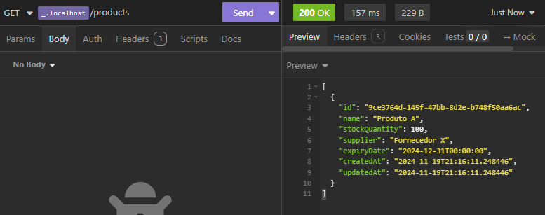
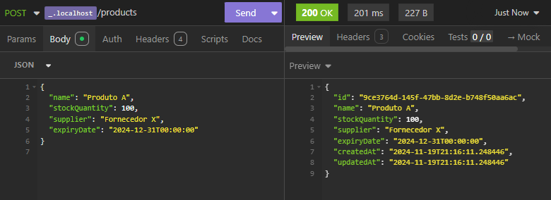
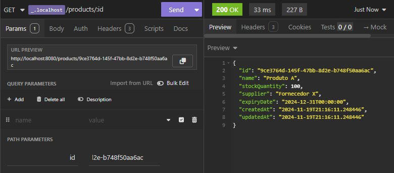
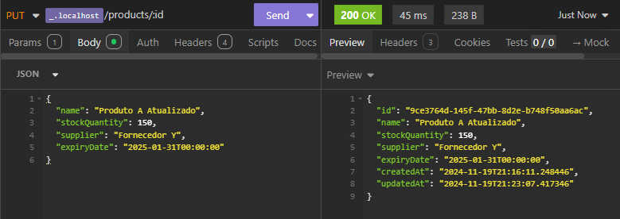
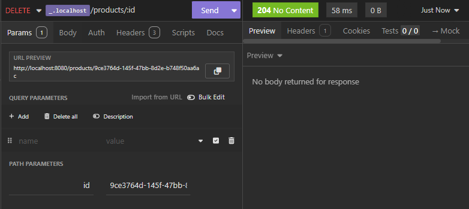

# Relatório da API

## **Rotas de Produto**

### **1. Listar todos os produtos**  

**URL**: `GET /products`  
**Descrição**: Retorna todos os produtos cadastrados.

  

**Exemplo de Resposta**:  

```json
[
  {
    "id": "123e4567-e89b-12d3-a456-426614174000",
    "name": "Produto A",
    "stockQuantity": 100,
    "supplier": "Fornecedor X",
    "expiryDate": "2024-12-31T00:00:00",
    "createdAt": "2024-11-01T12:00:00",
    "updatedAt": "2024-11-10T18:00:00"
  }
]
```

---

### **2. Criar um novo produto**  

**URL**: `POST /products`  
**Descrição**: Adiciona um novo produto ao sistema.



**Corpo da Requisição**:  

```json
{
  "name": "Produto A",
  "stockQuantity": 100,
  "supplier": "Fornecedor X",
  "expiryDate": "2024-12-31T00:00:00"
}
```

**Exemplo de Resposta**:  

```json
{
  "id": "123e4567-e89b-12d3-a456-426614174000",
  "name": "Produto A",
  "stockQuantity": 100,
  "supplier": "Fornecedor X",
  "expiryDate": "2024-12-31T00:00:00",
  "createdAt": "2024-11-10T12:00:00",
  "updatedAt": "2024-11-10T12:00:00"
}
```

---

### **3. Consultar um produto por ID**  

**URL**: `GET /products/{id}`  
**Descrição**: Retorna os detalhes de um produto específico pelo ID.



**Exemplo de Resposta**:  

```json
{
  "id": "123e4567-e89b-12d3-a456-426614174000",
  "name": "Produto A",
  "stockQuantity": 100,
  "supplier": "Fornecedor X",
  "expiryDate": "2024-12-31T00:00:00",
  "createdAt": "2024-11-10T12:00:00",
  "updatedAt": "2024-11-10T12:00:00"
}
```

---

### **4. Atualizar um produto**  

**URL**: `PUT /products/{id}`  
**Descrição**: Atualiza as informações de um produto existente.



**Corpo da Requisição**:  

```json
{
  "name": "Produto A Atualizado",
  "stockQuantity": 150,
  "supplier": "Fornecedor Y",
  "expiryDate": "2025-01-31T00:00:00"
}
```

**Exemplo de Resposta**:  

```json
{
  "id": "123e4567-e89b-12d3-a456-426614174000",
  "name": "Produto A Atualizado",
  "stockQuantity": 150,
  "supplier": "Fornecedor Y",
  "expiryDate": "2025-01-31T00:00:00",
  "createdAt": "2024-11-10T12:00:00",
  "updatedAt": "2024-11-12T15:00:00"
}
```

---

### **5. Deletar um produto**  

**URL**: `DELETE /products/{id}`  
**Descrição**: Remove um produto pelo ID.  



**Exemplo de Resposta**:  
**Status Code**: `204 No Content`  
**Corpo da Resposta**: (vazio)  

---

## **Rotas de Movimentação de Estoque**
